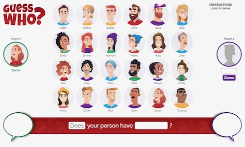
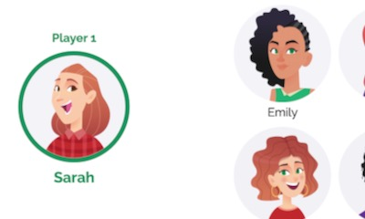
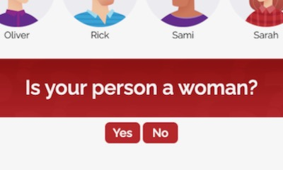
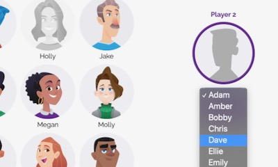

# Guess Who?



### A digital version of the classic family game

Guess Who? is a two-player guessing game typically played with boards featuring the faces of 20 or more fictional characters. Each player is assigned one of these characters—the "Mystery Person"—then the players take turns asking each other yes-or-no questions in an attempt to guess their opponent's character. If a character doesn't align with an opponent's response, a player can essentially remove that character's face from their board. The first player to narrow down the characters and correctly guess who their opponent was assigned wins.

This project—my first, as a member of General Assembly's software engineering immersive—is a digital version of Guess Who? The players are comprised of the user and the computer, and a digital board/grid is used to keep track of the computer's responses. Apart from those changes, the game is practically the same. The user asks the computer questions—the range of which is somewhat restricted in this version—and the computer asks them in return. Every time the user provides a response, the computer filters through its list of possible characters until it ends up with one, at which point, it makes its guess and ends the game. That is, unless the user can submit a correct guess first.

## Technology Used
---

Guess Who? was built using HTML, CSS and vanilla JavaScript.

Two Javascript files are used in this project: `people.js` contains all of the characters' data, while `app.js` handles the game's functionality.

## How to Play
---

Instructions for using the project and playing the game are included below, as well as within the game itself.

1. After opening the game, click `Pick Your Mystery Person` to be assigned your Mystery Person and start the game. You will see your Mystery Person on the left side of the window.



2. You get to ask a question first. Click on the black-bordered rectangles at the bottom to access dropdown menus that will enable you to craft your question. Depending on what feature you ask about, a third dropdown menu may appear, allowing you to make your question more specific.


3. Once you've built your question, click `Ask Question` to submit it. After some pondering, the computer will answer it with a "Yes" or a "No", seen in the speech bubble in the bottom-right corner.


4. Use the computer's response to mark-off any people who couldn't be the computer's Mystery Person. Do this by simply clicking on their face. When you're ready to move on, click `Next Question` at the bottom.


5. The computer will now ask you a question. Reference your Mystery Person's image in the top-left corner, and respond by clicking either `Yes` or `No`.



6. Once the computer has processed your response, it will either say, "Okay", or it will try and guess your Mystery Person. If it says, "Okay", click `Next Question` to ask your question, and repeat steps 2–6. If it makes a guess, the game will end.


7. Whenever you're ready to guess the computer's Mystery Person, select their name from the dropdown menu on the right side of the window and click `Guess`. The game will end and a message will appear, letting you know if your guess was correct.



8. Click `Pick Another Person` to play again.


## How the Game Works
---

The game is primarily composed of four distinct events:

1. The user (player 1) asks a question.

2. The computer (player 2) responds.

3. The computer asks a question.

4. The user responds.

These events loop until either the user submits a guess, or the computer filters its list of possible solutions down to one. Each event requires its own function, which are explained below.

| Event | Functions | What Happens |
| ----------- | ----------- | ----------- |
| The user asks a question | `handleSelectQuestionType`, `handleSelectFeature`, `handleSelectAdjective` | Given that this is the first version of the game, the question-asking process is pretty controlled. Eventually, I'd like to allow the user to type out any question they want, but for now, the user "builds" their question using dropdown menus populated with values from `people.js`. This prevents the user from asking a question that the computer won't understand. One dropdown contains all of the features the user can ask about, while a second contains adjectives related to those features (Note: not all features have adjectives). |
| The computer responds | `handleAsk` | Once the user builds their question and clicks `Ask Question`, the chosen feature and adjective (if selected) are recorded and compared to the object containing the computer's Mystery Person data. Depending on whether the chosen words align with that object, the computer responds with a "Yes" or "No". |
| The computer asks a question | `handleNext1`, `checkForValidQuestion`, `displayQuestion` | The computer keeps track of its possible solutions with the `possibilities` array, which at the start of a game, contains objects for every character. As the user responds to the computer's questions, the computer filters this array. The `checkForValidQuestion` function looks through the current state of `possibilities` and chooses a feature, or a feature and an adjective, that aligns with one of the remaining objects. It also chooses the feature that will filter out the greatest percentage of objects, allowing the computer to arrive at a solution faster. Once the optimal feature is chosen, the `displayQuestion` function displays the computer's completed question for the user. |
| The user responds | `handleResponse` | The user responds to the computer's question by clicking `Yes` or `No`. The computer then filters `possibilties` based on the response. If the array has more than one object after being filtered, the four-event process restarts, and the user is allowed to ask another question. However, if there's only one object left, the computer immediately stops the game and announces the solution. |

In addition to the four key events and their functions, there are a number of other functions that contribute to the game's interactivity. A few of the primary ones are listed below.

| Function | What it Does |
| ----------- | ----------- |
| `assignMysteryPerson` | Randomly assigns a character to the user and the computer |
| `clearGameboard` | Visually resets the gameboard between key events |
| `handleGuess` | Compares the selected character to the computer's Mystery Person, determining a win or loss |
| `handlePlayAgain` | Resets key data, such as the `possibilities` array, as well as visual elements |
| `fadePerson` | Fades and unfades character faces |
| `toggleInstructions` | Hides and shows the instructions |


## Installation
---

Instructions for accessing the project's working files on your local computer are included below.

1. Fork a copy of the game's repository [here.](https://github.com/delayedaa/guess-who.git)

2. Clone the copy to your local computer by typing the following code in your terminal:
```
git clone https://github.com/delayedaa/guess-who.git
```

3. To open the project, navigate to the cloned directory and open `index.html` in your browser by typing the following code in your terminal:
```
open index.html
```

## Credits
---

Thanks to `Vector_Vision` for the character illustrations. You can access more of their work on [Adobe Stock.](https://stock.adobe.com/contributor/206040275/vector-vision?load_type=author&prev_url=detail)